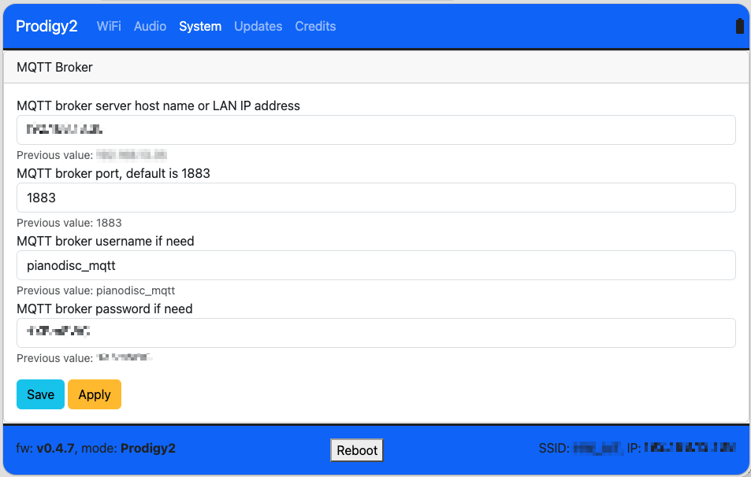

# Adding MQTT

MQTT is optional. The integration works without it, so set this up only when you want
what it adds.

## What MQTT gives you

| | Without MQTT | With MQTT |
|---|---|---|
| Playback state | Updated every 30 seconds | Updates the moment it changes |
| Finding the piano | You enter its IP address | Discovered automatically |
| **Keys active** sensor | Unavailable | Works |
| Everything else | Works | Works |

Speed is the difference you'll actually notice. Without MQTT, Home Assistant asks the
piano how it's doing every 30 seconds, so a song started on the piano itself — from its
own controls, or by auto-play — can take that long to show up in Home Assistant. With
MQTT it appears as it happens, which matters most if you're building automations that
react to the piano.

## What you need first

An MQTT broker that Home Assistant is connected to. If you don't have one, the usual
choice is the Mosquitto broker add-on — follow the
[official Home Assistant MQTT guide](https://www.home-assistant.io/integrations/mqtt/) to
install it and add the MQTT integration.

Come back here once **Settings → Devices & services** shows an **MQTT** entry.

## 1. Create a login for the piano

The piano signs in to your broker with its own username and password. Home Assistant
manages its own credentials separately, so the piano needs a login of its own.

If you're using the Mosquitto broker add-on:

1. Go to **Settings → Add-ons → Mosquitto broker → Configuration**.
2. Find the **Logins** option and add a username and password. If the page is showing
   YAML rather than form fields, that's:

   ```yaml
   logins:
     - username: pianodisc_mqtt
       password: choose-a-strong-password
   ```

3. Save, then restart the add-on.

Any username works — `pianodisc_mqtt` is just a clear one. Don't use `homeassistant` or
`addons`, which Home Assistant reserves for itself.

Keep the username and password handy for the next step.

## 2. Point the piano at your broker

You'll need the IP address of your Home Assistant server, which is shown under
**Settings → System → Network**.

1. Open the piano's settings screen in a browser at `http://<piano-ip-address>`.
2. Click **System** in the menu across the top.
3. Fill in the **MQTT Broker** section:

   | Field | Value |
   |---|---|
   | MQTT broker server host name or LAN IP address | Your Home Assistant server's IP address |
   | MQTT broker port, default is 1883 | `1883` |
   | MQTT broker username if need | The login you created above |
   | MQTT broker password if need | The password you created above |

4. Click **Save**, then **Apply**.
5. Restart the piano.



Each field shows its **Previous value** underneath, which is useful for checking what was
there before you change anything.

## 3. Check that it worked

After the piano restarts and connects, go to **Settings → Devices & services**.

**If the piano wasn't set up in Home Assistant yet,** a **PianoDisc Prodigy II
discovered** card appears. Click **Configure**.

**If you already added it by IP address,** nothing new appears — the integration picks up
MQTT on its own. To confirm it worked, start a song and watch the **Keys active** sensor:
it should turn on as the piano begins playing, instead of staying unavailable.

## Add the IP address too, if you set it up by discovery

A piano discovered over MQTT arrives without an IP address, and older firmware needs one
for the song library, playlists and firmware versions.

To add it: open the integration entry, choose **Reconfigure**, and enter the piano's IP
address. Home Assistant checks that the address belongs to this same piano, so a mistyped
address can't point the entry at a different instrument.

Running with both MQTT and an IP address is the best configuration — you get instant
updates, and Home Assistant can still reach the piano directly if the broker is
unavailable.

## If discovery doesn't happen

- Confirm the MQTT integration is set up in Home Assistant and the broker is running.
- Check the broker's logs for authentication failures — a wrong password shows up there.
- Confirm the broker address you entered on the piano is the Home Assistant server's
  address, not the piano's own.
- Restart the piano so it republishes.

More in the [troubleshooting guide](troubleshooting.md).
